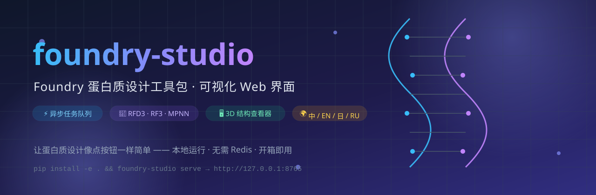

<p align="center">
  
</p>

<p align="center">
  <b>Foundry 蛋白质设计工具包的可视化 Web 界面</b><br/>
  🧬 让蛋白质设计像点按钮一样简单
</p>

<p align="center">
  
  
  
  
  
  
</p>

---

## 📖 这是什么？

**foundry-studio** 是 [RosettaCommons Foundry](https://github.com/RosettaCommons/foundry)（华盛顿大学蛋白质设计研究所出品的蛋白质设计工具箱）的**可视化 Web 界面**。

Foundry 本身是命令行工具——功能强大，但每次都要敲一长串命令、记一堆参数。foundry-studio 把这一切**包装成了网页**：

- 在浏览器里**点点选选**就能配置蛋白质设计任务
- 提交后**后台异步执行**，随时刷新看进度
- 完成后**直接在网页里 3D 查看**生成的结构
- 模型权重**一键安装 / 清理**，不再手敲命令

> 🎯 一句话：**把「专业命令行工具」变成「人人可用的网页应用」。**

---

## ✨ 功能特性

| 功能 | 说明 |
|------|------|
| ⚡ **异步任务队列** | 提交任务后立即返回，后台 worker 常驻执行，不阻塞界面 |
| 🧬 **四大模型全覆盖** | RFD3（设计）、RFD3NA（核酸设计）、RF3（结构预测）、ProteinMPNN（序列设计） |
| 🖥️ **3D 结构查看器** | 内置 NGL 查看器：卡通 / 球棍 / 表面 / 空间填充 / 丝带 5 种表示，4 种配色 |
| 🌍 **四语界面** | 中文 / English / 日本語 / Русский，一键切换，自动记忆偏好 |
| 📦 **权重管理** | 网页里一键安装 / 重新安装 / 清理模型权重（checkpoint） |
| 📝 **动态参数表单** | 每个模型的参数自动生成表单，不懂的参数有中文说明 |
| 🎛️ **高级 JSON 模式** | 老手可以直接粘贴原始引擎参数，完全控制 |
| 📜 **实时日志流** | 运行日志实时推送（SSE），出错看得一清二楚 |
| 💾 **纯本地运行** | 用 SQLite 做队列，**不需要 Redis、不需要数据库服务器**，开箱即用 |
| 🐳 **Docker 一键部署** | 带 GPU 透传的容器化方案，生产环境直接起 |

---

## 🧩 支持的模型

Foundry 官方发布了四个模型，foundry-studio **全部支持**：

| 模型 | 中文名 | 它是干什么的？ | 输入 | 输出 |
|------|--------|---------------|------|------|
| **RFD3** | RFdiffusion3 | **凭空设计蛋白质**。给一段长度规格（如"A1-100"表示 100 个残基的单链），它用扩散模型生成全新的蛋白骨架 | 设计规格（contigs/hotspots/symmetry）+ 可选骨架 CIF | 设计好的蛋白结构 CIF |
| **RFD3NA** | RFdiffusion3NA | 设计**蛋白质 + 核酸**复合物（比如蛋白与 DNA/RNA 结合的设计） | 设计规格（含核酸链） | 复合物结构 CIF |
| **RF3** | RosettaFold3 | **预测蛋白质结构**。给定氨基酸序列，预测它会折叠成什么 3D 形状（对标 DeepMind AF-3 的开源替代） | 序列 FASTA / 模板 CIF | 预测结构 CIF + pLDDT |
| **ProteinMPNN** | 蛋白质 MPNN | **逆折叠**。给定一个蛋白骨架，帮你设计出能折叠成这个形状的氨基酸序列 | 骨架结构 CIF/PDB | 设计序列 FASTA + 结构 |

---

## 🚀 快速开始

### 第一步：安装后端

```bash
git clone https://github.com/syxscott/foundry-studio.git
cd foundry-studio

# 创建虚拟环境（推荐）
python -m venv .venv
# Windows
.venv\Scripts\pip install -e .
# macOS / Linux
.venv/bin/pip install -e .
```

### 第二步：启动服务

```bash
# Windows
.venv\Scripts\foundry-studio serve
# macOS / Linux
.venv/bin/foundry-studio serve
```

打开浏览器访问 **http://127.0.0.1:8765** 🎉

> 💡 API 文档（Swagger）在 http://127.0.0.1:8765/docs

### 第三步：安装模型权重（跑真实任务才需要）

```bash
# Windows
.venv\Scripts\foundry-studio install-checkpoints rfd3 rf3 proteinmpnn
# macOS / Linux
.venv/bin/foundry-studio install-checkpoints rfd3 rf3 proteinmpnn
```

或者直接在网页的「环境」页面点「安装」按钮，效果一样。

### 第四步（可选）：构建前端

如果仓库里带了 `frontend/dist`，后端会自动托管前端，上一步就能用了。如果你是开发者想自己构建：

```bash
cd frontend
npm install
npm run build
```

开发模式用 `npm run dev`，然后访问 **http://localhost:5173**（Vite 会自动把 `/api` 代理到后端）。

---

## 🎭 两种运行模式（重要，请读一下）

foundry-studio 有两种「引擎模式」，理解这点能避免困惑：

### 1. 真实引擎模式（Real Engine）— 真正的科学计算

需要满足两个条件：
- 机器上安装了 **rc-foundry**（Foundry 官方 Python 包，包含 PyTorch 等重型依赖）
- 对应模型的 **checkpoint 权重已下载**

满足后，任务由**真实的 Foundry 引擎**执行，结果就是**真正的科学产出**，可直接用于论文和实验。

### 2. 模拟模式（Simulation Mode）— 体验流程用的演示通道

如果你的机器**没有 GPU / 没装 rc-foundry / 没下载权重**，foundry-studio 会自动降级到内置的**模拟引擎**。

模拟引擎会生成**格式完全合法的 CIF / FASTA 文件**，让你把「上传 → 排队 → 执行 → 结果 → 3D 查看 → 下载」**整套流程完整走一遍**，方便开发、演示、教学。

> ⚠️ **重要声明**：模拟模式的结果**不是真实预测**！界面顶部会一直显示**琥珀色警告横幅**，任务详情里也有标注——它只用于流程验证，绝不伪装成真实结果。

### 三种模式切换

| 配置值 | 行为 |
|--------|------|
| `auto`（默认） | 真实引擎可用就用真实，否则自动降级模拟 |
| `real` | 强制真实引擎，不可用则任务直接失败并提示原因 |
| `simulation` | 强制模拟模式（演示 / 测试用） |

---

## 🖥️ 界面预览

| 页面 | 功能 |
|------|------|
| **🏠 新建任务** | 选择模型 → 配置参数 → 上传文件 → 提交 |
| **📋 任务列表** | 所有任务一览，按状态筛选，实时刷新 |
| **🔬 任务详情** | 参数 / 输入文件 / 输出结果 / 3D 查看 / 实时日志 |
| **📦 环境管理** | 权重安装状态、一键安装、清理 |

---

## 🌍 多语言支持

界面支持 **4 种语言**，右上角一键切换，选择会被记住（localStorage）：

- 简体中文 🇨🇳
- English 🇺🇸
- 日本語 🇯🇵
- Русский 🇷🇺

实现方式：前端用 i18next（完整 UI 文案 4 语翻译），后端错误消息也是结构化的「错误码 + 参数」，由前端按当前语言渲染。**新增语言只需加一个翻译文件。**

---

## 🏗️ 架构一览

```
┌──────────────────────── 浏览器 ────────────────────────┐
│  React SPA（Vite + TS + Tailwind + NGL 3D 查看器）     │
│  首页 · 任务列表 · 任务详情 · 环境管理 · 四语切换        │
└──────────────────────────┬─────────────────────────────┘
                           │ HTTP/JSON + SSE 日志流
┌──────────────────────────▼─────────────────────────────┐
│  FastAPI 后端（Python）                                 │
│  · REST API：任务 / 模型 / 权重 / 文件 / i18n           │
│  · SQLite（WAL）：任务队列 + worker 心跳（无需 Redis）  │
│  · 引擎注册表：auto / real / simulation 三模式          │
└──────────────┬──────────────────────┬──────────────────┘
               │ 子进程                │ 心跳 / 状态
┌──────────────▼──────────────┐  ┌────▼──────────────────┐
│ Worker 进程（每模型一个）   │  │ 数据目录               │
│ 模型只加载一次，多任务复用   │  │ jobs/<id>/ 输入+输出   │
│ 崩溃自动重启，任务自动恢复   │  │ logs/<id>.log 日志    │
└─────────────────────────────┘  └───────────────────────┘
```

设计要点：

- **SQLite 即队列**：任务表本身就是队列，`claim_next_job` 原子领取，多进程安全——本机部署**零外部依赖**
- **模型常驻**：每个 worker 进程启动时加载一次模型权重（利用了上游 `initialize()/run()` 分离设计），之后所有任务复用，不重复加载数 GB 权重
- **崩溃恢复**：worker 挂了，管理器自动重启，遗留的 running 任务自动回到队列重新执行
- **真实调用**：直接 import 上游引擎类调用 `.run()`，**不包装 CLI、不解析终端输出**

---

## ⚙️ 配置项

所有配置用环境变量（前缀 `FOUNDRY_STUDIO_`）或 `.env` 文件（见 `.env.example`）：

| 变量 | 默认值 | 说明 |
|------|--------|------|
| `FOUNDRY_STUDIO_HOST` | `127.0.0.1` | 绑定地址 |
| `FOUNDRY_STUDIO_PORT` | `8765` | 端口 |
| `FOUNDRY_STUDIO_DATA_DIR` | `~/.foundry-studio` | 数据目录（任务/日志/输出） |
| `FOUNDRY_STUDIO_ENGINE_MODE` | `auto` | `auto` / `real` / `simulation` |
| `FOUNDRY_STUDIO_ALLOW_SIMULATION_FALLBACK` | `true` | 是否允许自动降级模拟模式 |
| `FOUNDRY_STUDIO_WORKER_AUTOSTART` | `true` | 启动时自动拉起 worker 进程 |
| `FOUNDRY_STUDIO_FRONTEND_DIST` | 空 | 已构建前端目录（serve 时用） |
| `FOUNDRY_STUDIO_ALLOW_REMOTE_ACCESS` | `false` | 是否允许局域网访问（默认仅本机） |

---

## 🐳 Docker 部署（GPU 生产环境）

```bash
docker compose up --build
# 打开 http://localhost:8765
```

镜像会自动安装完整的 Foundry 依赖栈（`rc-foundry[all]`），并**共享宿主机的 `~/.foundry/checkpoints`** 权重目录，与命令行安装的权重互通。没有 GPU 也能跑（自动进入模拟模式）。

---

## 🧪 测试

```bash
.venv/bin/pip install -e ".[dev]"
.venv/bin/pytest backend/tests -q
```

覆盖内容：任务状态机、API 全流程（创建→上传→提交→执行→下载）、错误本地化、模拟引擎产物、权重注册表——全部离线可跑。

---

## 📂 项目结构

```
foundry-studio/
├── backend/foundry_studio/      # FastAPI 后端
│   ├── api/                     # REST 路由 + 错误处理
│   ├── engines/                 # 模型注册表 + 真实/模拟引擎
│   ├── workers/                 # worker 进程 + 监督管理器
│   ├── app.py / main.py / cli.py
│   └── i18n.py                  # 后端四语消息目录
├── frontend/src/                # React 前端
│   ├── i18n/                    # 中 / 英 / 日 / 俄 翻译
│   ├── pages/                   # 首页 / 任务 / 详情 / 环境
│   ├── components/              # NGL 查看器 / 状态徽章 / 横幅
│   └── api/client.ts            # 类型化 API 客户端
├── tests/                       # pytest 测试套件
├── docs/                        # 文档 + 封面图
├── Dockerfile / docker-compose.yml
└── pyproject.toml
```

详细架构说明见 [docs/architecture.md](docs/architecture.md)。

---

## ❓ 常见问题（FAQ）

**Q：我没有 GPU，能用吗？**
A：能。foundry-studio 会自动进入模拟模式，整套流程（界面、上传、队列、3D 查看）都能体验。但要跑**真实的蛋白质设计计算**，RFD3 / RF3 需要 NVIDIA GPU（CUDA）。

**Q：装了 rc-foundry 但模型还是模拟模式？**
A：大概率是**权重没下载**。去「环境」页面看对应模型的权重状态，点「安装」即可（或命令行 `foundry-studio install-checkpoints`）。

**Q：任务一直排队不动？**
A：检查「环境」页或 `GET /api/health` 里的 worker 状态。worker 进程异常退出会自动重启；也可以设置 `FOUNDRY_STUDIO_WORKER_AUTOSTART=true`（默认开启）。

**Q：能在局域网里给别人用吗？**
A：可以。设置 `FOUNDRY_STUDIO_HOST=0.0.0.0` 和 `FOUNDRY_STUDIO_ALLOW_REMOTE_ACCESS=true`。**注意**：对外暴露前请务必加反代 + TLS + 鉴权，因为这是重计算资源。

**Q：结果文件在哪里？**
A：默认在 `~/.foundry-studio/jobs/<任务id>/`，网页上也可以直接下载。

**Q：模拟模式的 CIF 能用于实验吗？**
A：**不能**。那是流程验证用的占位数据，不是真实预测。请务必安装权重用真实引擎。

---

## 🤝 致谢与许可

- 本工具包装 **RosettaCommons Foundry**（[BSD-3-Clause](https://github.com/RosettaCommons/foundry)），模型权重版权归原作者（华盛顿大学蛋白质设计研究所等）
- foundry-studio 本身采用 **MIT License**

---

<p align="center">
  Made with 🧬 for the protein design community · <a href="https://github.com/syxscott/foundry-studio">github.com/syxscott/foundry-studio</a>
</p>
